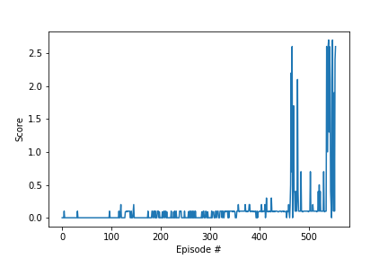

# multiagent-tennis
An implementation of Multi-Agent Deep Deterministic Policy Gradients (MADDPG) for two agents to play a tennis rally in a Unity environment.

## The Problem
In this task, we train two reinforcement-learning agents control rackets to bounce a ball over a net. If an agent hits the ball over the net, it receives a reward of +0.1. If an agent lets a ball hit the ground or hits the ball out of bounds, it receives a reward of -0.01. The goal of each agent is to keep the ball in play.

## The Environment
We are using the Tennis environment from the Unity ML-Agents plugin for this task.


The observation space consists of 24 variables corresponding to the position and velocity of the ball and racket. Each agent receives its own, local observation. Two continuous actions are available, corresponding to movement toward (or away from) the net, and jumping. After each episode, we add up the rewards that each agent received (without discounting), to get a score for each agent. This yields 2 (potentially different) scores. We then take the maximum of these 2 scores as the episode score. The environment is considered solved when the average episode score is at least +0.5 over 100 consecutive episodes.

## Running the Code
All code, as well as detailed descriptions of the workflow, are in ```Report.ipynb```. Make sure the file name for loading the correct UnityEnvironment is appropriate to your machine. Available environments are in the ```envs``` folder in this repository. Alternatively, they are available for download in the links below:
 * Linux: [click here](https://s3-us-west-1.amazonaws.com/udacity-drlnd/P3/Tennis/Tennis_Linux.zip)
 * Mac OSX: [click here](https://s3-us-west-1.amazonaws.com/udacity-drlnd/P3/Tennis/Tennis.app.zip)
 * Windows (32-bit): [click here](https://s3-us-west-1.amazonaws.com/udacity-drlnd/P3/Tennis/Tennis_Windows_x86.zip)
 * Windows (64-bit): [click here](https://s3-us-west-1.amazonaws.com/udacity-drlnd/P3/Tennis/Tennis_Windows_x86_64.zip)
 
 The code in ```Report.ipynb``` walks through an implementation of deep reinforcement learning agents trained with the Multi-Agent Deep Deterministic Policy Gradients (MADDPG) approach and Actor-Critic network structures. To reduce sequential data correlations, each agent keeps a memory replay buffer to store environmental interactions and randomly sample minibatches to update the network parameters, and both local and target copies of each network are kept to update at different rates. Action exploration by the agents is regulated through an Ornstein-Uhlenbeck process with decaying variance at each episode. Each agent has its own set of actor networks and a memory buffer for experience replay, and all agents share a set of critic networks.
 
## Results
This environment is solved in 556 episodes, with models saved to ```actor0.pth```, ```actor1.pth```, and ```critic.pth```. A plot of the learning curve is saved in ```learning_curve.png``` and is also shown below:

